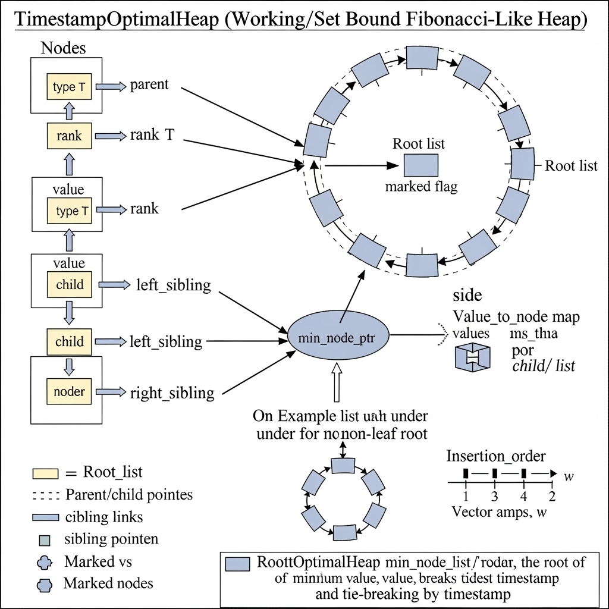

# ⏱️ Timestamp-Optimal Heap

A C++ implementation of a **Timestamp-Optimal Heap** — a custom priority queue designed to replace the traditional Fibonacci heap,
exploiting **temporal locality** in practical settings of finding the shortest path in Dijkstras's algo.
The main goal is to **accelerate algorithms like Dijkstra’s** by avoiding **worst case**.

Inspired by the research breakthroughs in:
- _Universal Optimality of Dijkstra via Beyond-Worst-Case Heaps_
- _Simple Universally Optimal Dijkstra_

## 📌 References
- Haeupler, B., Hladík, R., Rozhoň, V., Tarjan, R. E., & Tetĕk, J. (2024, October). _Universal Optimality of Dijkstra via Beyond-Worst-Case Heaps_. In *2024 IEEE 65th Annual Symposium on Foundations of Computer Science (FOCS)* (pp. 2099–2130). IEEE. [https://doi.org/10.1109/FOCS57990.2024.00154](https://doi.org/10.1109/FOCS57990.2024.00154)

- van der Hoog, I., Rotenberg, E., & Rutschmann, D. (2025). _Simple Universally Optimal Dijkstra_. *arXiv preprint arXiv:2504.17327*. [https://arxiv.org/abs/2504.17327](https://arxiv.org/abs/2504.17327)

---

## 📜 Background

- Traditional priority queues, such as Min-heap and Max-heap(binary-heap data structure), achieved `O(log n)` amortized time for both insert and delete operations. By contrast, Fibonacci heaps outperform by achieving amortized `O(1)` time for get_min, insert, meld, and decrease_key operations. However, the amortized time of extract_min was still a pain point in the prod env, which cost `O(log n)` time. While this is considered efficient enough for smaller problems, it is a bottleneck for real-world problems in large-scale graph searching. 
- In recent studies, the research groups have revealed that node access patterns often exhibit **temporal locality** in many cases where the same or neighboring nodes are very likely to be accessed within short time spans. Based on this finding, researchers proposed a more advanced heap structure to maximize regional optimization over time and avoid the occurrence of the worst case. The idea is similar to some of today's caching mechanisms, where data is logically separated into 'Hot' and 'Cold' during computing. And this heap is able to pay closer attention to those important data nodes(frequently visited ones) in a dynamic graph, rather than wasting time sorting out the entire heap.
- Specifically, in these papers, the novel heap structure that utilizes the **working-set property**(prioritize recently accessed nodes) and **Timestamp**(help track and manage node access efficiently) can minimize the cost of getting the min value from a min heap after removing it from the heap(due to maintaining the overall heap structure and its properties). 
- The key idea is that the cost of deleting the min node is logarithmic in the number of nodes inserted after it, but before it is deleted, instead of logarithmic in the size of the heap when the node is deleted, which makes use of locality in the heap operations to achieve universal optimality.
- Unlike Multi-Level Dijkstra with Contraction Hierarchies in Open Source Routing Machine (OSRM), working based on the cached order, this solution doesn't require static and computational preprocessing.
## Goals:
- 🧮 **Insert:** Amortized `O(1)` time
- 🔁 **Decrease-Key:** Amortized `O(1)` time
- 📤 **Extract-Min:** Amortized `O(log w)` time
  (_where_ `w` _is the working-set size – the number of operations since the item was inserted_)

---

## 🛠 Core Concepts & Implementation Strategy

This is not a standard binary or Fibonacci heap. The design blends a couple of advanced strategies to achieve optimal performance:

### 🌲 1. Forest of Heap-Ordered Trees
- Structure resembles a **Fibonacci Heap**: a list of tree roots ordered by heap property.
- **Lazy insertions**: elements are simply added to the root list without restructuring.

### ⏱️ 2. Working-Set Property via Timestamps
- Every node gets a **timestamp** upon insertion or key update.
- During `extract-min`, only **"hot" nodes** (recently accessed) are processed.
- This ensures operations remain bounded by `log(w)`, not `log(n)`.

### 🔧 3. Key Operations

#### `insert()` — **Amortized O(1)**
- Adds a new, single-node tree to the root list.

#### `decrease_key()` — **Amortized O(1)**
- Cuts the node from its parent and promotes it to the root list.
- Efficient thanks to:
    - **Circular, doubly-linked child lists** for `O(1)` removals.
    - **Cascading cuts** to maintain balanced trees.

#### `extract_min()` — **Amortized O(log w)** ✨
- Cached pointer gives `O(1)` access to the min node.
- Children of the min node are promoted to the root list.
- **Consolidation** only affects **"hot" roots** (with timestamps ≥ extracted node).
    - This limits work done to size `w`, not `n`.

---

## 📊 Complexity Analysis

| Operation       | Implementation  | Paper Idea | Alignment |
|-----------------|-----------------|------------|-----------|
| insert          | O(1)    | O(1)       | ✓         |
| decrease_key    | O(1)    | O(1)       | ✓         |
| extract_min     | O(log w) | O(log w)   | ✓         |
| get_min/pop_min | O(1)            | O(1)       | ✓         |

---

## 🚀 Features

- ✅ **Generic & Templated:**  
  `template<typename T, typename Compare>` supports any data type and custom comparison logic.

- 🧩 **Efficient Node Lookups:**  
  Uses `std::unordered_map` for `O(1)` average-time access during `decrease-key`.

- 🔍 **O(1) top() Operation:**  
  Maintains a cached pointer to the current min node.

- 🧼 **Robust Memory Management:**
    - Properly follows the **Rule of Three/Five**.
    - Disables copy/assignment to avoid accidental deep copies.
    - Periodically **prunes the insertion log** to prevent memory bloat.

- ⚖️ **Deterministic Tie-Breaking:**
    - Timestamps act as a secondary criterion for comparing equal-priority elements.
    - Guarantees **stable and predictable ordering**.

---
